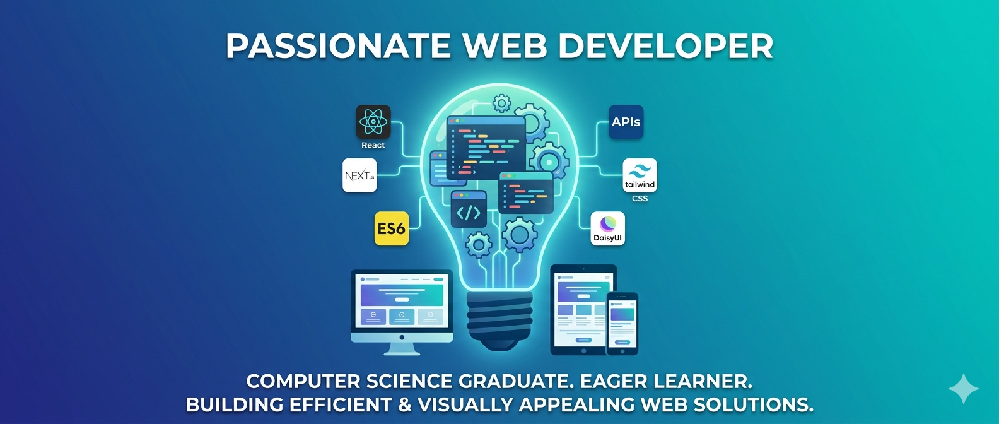

<!-- Banner Image -->


<h1 align="center">Hi 👋, I'm Monoara Tasnim</h1>
<h3 align="center">Frontend Developer | React ⚛️ & Next.js 🚀 | Building clean & responsive UIs</h3>

📍 Chattogram, Bangladesh  
✉️ hossainneeha8@gmail.com

---

## About Me
Hi! I’m Monoara, a passionate frontend developer from Bangladesh. I enjoy crafting fast and responsive web applications with clean and intuitive interfaces.  

- 🌱 I’m currently exploring **Next.js**  
- 💻 Working on a **tourism website project**  
- 🎯 Focused on improving **UI/UX design skills**  

---

## Connect with Me
<p align="left">
  <a href="https://linkedin.com/in/monoara-tasnim" target="blank"></a>
  <a href="https://facebook.com/monoara-tasnim-neeha" target="blank"></a>
  <a href="https://www.tiktok.com/@yourprofile" target="blank"></a>
  <a href="https://snapchat.com/add/yourprofile" target="blank"></a>
</p>

---

## Languages & Tools
<p align="left">
  <a href="https://www.w3schools.com/html/" target="_blank" rel="noreferrer">  </a>
  <a href="https://www.w3schools.com/css/" target="_blank" rel="noreferrer">  </a>
  <a href="https://developer.mozilla.org/en-US/docs/Web/JavaScript" target="_blank" rel="noreferrer">  </a>
  <a href="https://reactjs.org/" target="_blank" rel="noreferrer">  </a>
  <a href="https://nextjs.org/" target="_blank" rel="noreferrer">  </a>
  <a href="https://tailwindcss.com/" target="_blank" rel="noreferrer">  </a>
  <a href="https://www.figma.com/" target="_blank" rel="noreferrer">  </a>
  <a href="https://git-scm.com/" target="_blank" rel="noreferrer">  </a>
</p>

---

## GitHub Stats


---

## Pinned Repositories
### 1. Tourism Website
**Description:** A responsive tourism website built with Next.js & Tailwind CSS.  
**Live Link:** [Tourism Site](https://tourism-site-live.com)  
**Main Features:** Interactive maps, booking form, smooth UI  
**Dependencies:** React, Next.js, Tailwind CSS, DaisyUI  
**Run Locally:**
```bash
git clone https://github.com/username/tourism-website.git
cd tourism-website
npm install
npm run dev
